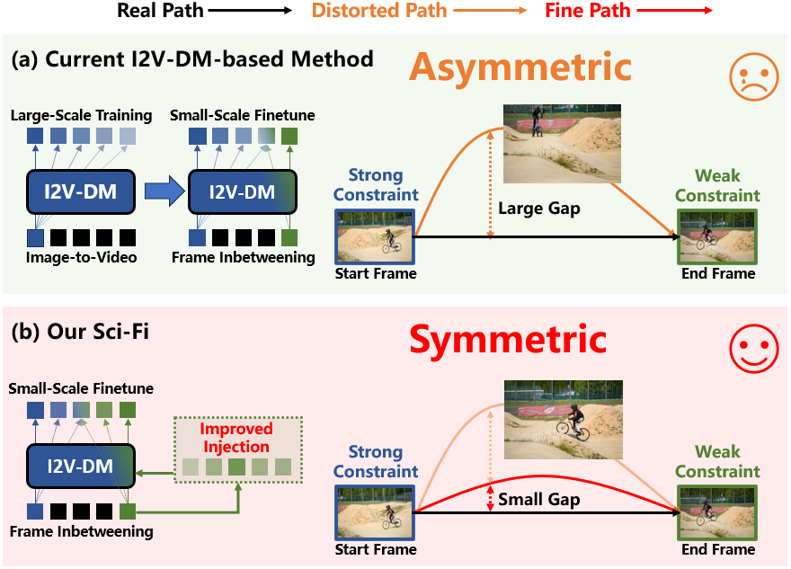

## Sci-Fi: Symmetric Constraint for Frame Inbetweening
<h5>Liuhan Chen<sup>1</sup>, <a href='https://vinthony.github.io'>Xiaodong Cun</a><sup>2,*</sup>, <a href='https://xiaoyu258.github.io/'>Xiaoyu Li</a><sup>3</sup>, Xianyi He<sup>1,4</sup>, Shenghai Yuan<sup>1,4</sup>,  Jie Chen<sup>1</sup>, Ying Shan<sup>3</sup>, Li Yuan<sup>1,*</sup></h5>

<sup>1</sup>Shenzhen Graduate School, Peking University &nbsp;&nbsp;&nbsp; <sup>2</sup><a href='https://gvclab.github.io'>GVC Lab, Great Bay University</a>  &nbsp;&nbsp;&nbsp; 
<sup>3</sup>ARC Lab, Tencent PCG &nbsp;&nbsp;&nbsp; <sup>4</sup>Rabbitpre Intelligence

## Method comparison
<div align="center">
  
</div>
(a) In current I2V-DM-based methods, the end-frame constraint is weaker than the start-frame constraint due to the same injection mechanism but a smaller training scale, causing a distorted predicted path with collapsed content. \\
(b) Our Sci-Fi maintains start frame processing while enhancing end-frame constraint injection. This achieves symmetric start-end-frame constraints with small training, yielding a fine predicted path close to the real one with smoother inbetweening.

## Some challenging examples of our Sci-Fi for frame inbetweening.
<table class="center">
    <tr style="font-weight: bolder;text-align:center;">
        <td>Start frame</td>
        <td>End frame</td>
        <td>Generated video</td>
    </tr>
  	<tr>
	  <td>
	    
	  </td>
	  <td>
	    
	  </td>
	  <td>
	    
	  </td>
  	</tr>
  	<tr>
	  <td>
	    
	  </td>
	  <td>
	    
	  </td>
	  <td>
     	    
	  </td>
  	</tr>
         <tr>
	  <td>
	    
	  </td>
	  <td>
	    
	  </td>
	  <td>
     	    
	  </td>
  	</tr>
	<tr>
	  <td>
	    
	  </td>
	  <td>
	    
	  </td>
	  <td>
     	    
	  </td>
  	</tr>
</table >

## Deployment for personal use
### 1. Setup the repository and environment
```
git clone https://github.com/GVCLab/Sci-Fi.git
cd Sci-Fi
conda create -n Sci-Fi python==3.12
conda activate Sci-Fi
pip install -r requirements.txt
```
### 2. Download checkpoint
Download the CogVideoX-5B-I2V model (due to fine-tuning, the weights of the transformer denoiser are different from the original) and EF-Net.
The weights are available at [🤗HuggingFace](https://huggingface.co/LiuhanChen/Sci-Fi) and [🤖ModelScope](https://www.modelscope.cn/models/clhxclh/Sci-Fi).

### 3. Launch the inference script!
The example input keyframe pairs are in `examples/` folder, and 
the corresponding generated videos (720x480, 49 frames) are placed in `outputs/` folder.
</br>
To interpolate, run:
```
bash Sci_Fi_frame_inbetweening.sh
```
